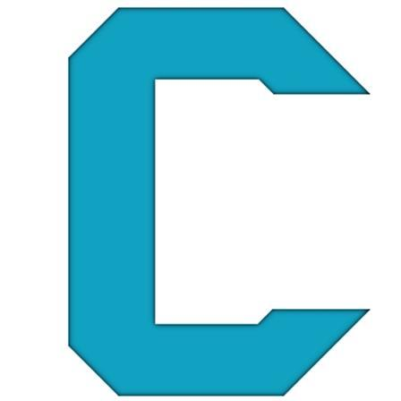
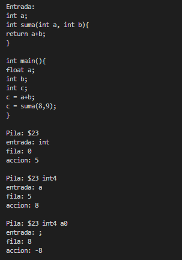
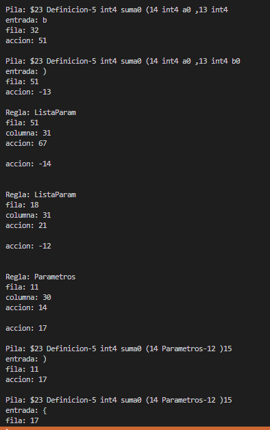

# Compilador-c
 Compilador de c hecho en c++ :)

<!-- Improved compatibility of back to top link: See: https://github.com/othneildrew/Best-README-Template/pull/73 -->
<a name="readme-top"></a>
<!--
*** Thanks for checking out the Best-README-Template. If you have a suggestion
*** that would make this better, please fork the repo and create a pull request
*** or simply open an issue with the tag "enhancement".
*** Don't forget to give the project a star!
*** Thanks again! Now go create something AMAZING! :D
-->


<!-- PROJECT SHIELDS -->
<!--
*** I'm using markdown "reference style" links for readability.
*** Reference links are enclosed in brackets [ ] instead of parentheses ( ).
*** See the bottom of this document for the declaration of the reference variables
*** for contributors-url, forks-url, etc. This is an optional, concise syntax you may use.
*** https://www.markdownguide.org/basic-syntax/#reference-style-links
-->


<!-- PROJECT LOGO -->
<br />
<div align="center">
  <a href="https://github.com/Crissomar1/Compilador-c">
    
  </a>

  <h3 align="center">Compilador C de Crisso</h3>

  <p align="center">
    Proyecto hecho para el Seminario de Solucion de Problemas de Traductores de Lenguaje
    <br />
    <a href="https://github.com/Crissomar1/Compilador-c"><strong>Explore los archivos »</strong></a>
    <br />
    <br />
    <a href="https://github.com/Crissomar1/Compilador-c">Mire la demostracion</a>
    ·
    <a href="https://github.com/Crissomar1/Compilador-c/issues">Reporte un error</a>
    ·
    <a href="https://github.com/Crissomar1/Compilador-c/issues">Solicite una funcion</a>
  </p>
</div>


<!-- TABLE OF CONTENTS -->
<details>
  <summary>Tabla de contenidos</summary>
  <ol>
    <li>
      <a href="#Acerca-del-proyecto">Acerca del proyecto</a>
      <ul>
        <li><a href="#Hecho-con">Hecho con</a></li>
      </ul>
    </li>
    <li>
      <a href="#Iniciacion">Iniciacion</a>
      <ul>
        <li><a href="#Prerrequisitos">Prerrequisitos</a></li>
        <li><a href="#Instalacion">Instalacion</a></li>
      </ul>
    </li>
    <li><a href="#Uso">Uso</a></li>
    <li><a href="#roadmap">Roadmap</a></li>
    <li><a href="#Contacto">Contacto</a></li>
    <li><a href="#Agradecimientos">Agradecimientos</a></li>
  </ol>
</details>


<!-- ABOUT THE PROJECT -->
## Acerca del proyecto



_texto en la primera imagen: "int america= 2323; float locura = 12.313; if (america == locura)"_

Para el analizador lexico me inspire del codigo que proporciono el profesor, agregue los estados necesarios al automata y las salidas necesarias, defini las palabras reservadas y listo.

Funciones:
* Analiza por elemento lexico.
* Identifica el tipo de elemento.
* Identifica errores en la entrada.

###Automata

```cpp
while (continua){
      c= sigCaracter();
      
      switch (estado){
        case 0:
               if(esEspacio(c)) estado=0;
               else
               if(esLetra(c)) sigEstado(9);
               else
             if ( c == '+' || c=='-') aceptacion(2);
             else
             if ( c == '*' || c=='/') aceptacion(0);
             else
             if ( c == '=') sigEstado(4);
             else
              if ( c == '$' ) aceptacion(3);
               else
               if(esDigito(c)) sigEstado(1);
               else
               if(c == '.') aceptacion(-2);
               else
               if(c == '<'|| c=='>') sigEstado(5);
               else
               if(c == '!') sigEstado(6);
               else
               if(c == '&') sigEstado(7);
               else
               if(c == '|') sigEstado(8);
               else
               if(c == '('||c == ')') aceptacion(10);
               else
               if(c == '{'||c == '}') aceptacion(11);
               else
               if(c == ';') aceptacion(12);

             break;
          case 1:
               if(esDigito(c)) sigEstado(1);
               else
               if(c=='.') sigEstado(2);
               else{
               retroceso();
               estado=1;
               continua=false;}
               break;

          case 2:
               if(esDigito(c)) sigEstado(3);
               else{
                    retroceso();
                    estado=-1;
                    continua=false;
               }
               break;
               
          case 3:
               if(esDigito(c)) sigEstado(3);
               else{
               retroceso();
               estado=5;
               continua=false;}
               
               break;  
          case 4:
               if(c=='=') aceptacion(4);
               else{
               retroceso();
               estado=6;
               continua=false;}
               break; 
          case 5:
               if(c=='=') aceptacion(4);
               else{
               retroceso();
               estado=4;
               continua=false;}
               break;
          case 6:
               if(c=='=') aceptacion(4);
               else{
               retroceso();
               estado=7;
               continua=false;}
               break; 
          case 7:
               if(c=='&') aceptacion(8);
               else{
               retroceso();
               estado=-1;
               continua=false;}
               break;
          case 8:
               if(c=='|') aceptacion(9);
               else{
               retroceso();
               estado=-1;
               continua=false;}
               break;
          case 9:
               if(esLetra(c)) sigEstado(9);
               else{
                    string res = esReservada(simbolo);
                    if(res!=""){
                    retroceso();
                    estado=20;
                    continua=false;
                    } 
               
               else
               if(esDigito(c)) sigEstado(10);
               else{
               retroceso();
               estado=14;
               continua=false;}}
               break;    
          case 10:
               if(esLetra(c)) sigEstado(9);
               else 
               if(esDigito(c)) sigEstado(10);
               else{
               retroceso();
               estado=14;
               continua=false;}
      }  
           
   }    
```

<p align="right">(<a href="#readme-top">back to top</a>)</p>


### Hecho con


* [![Cpp][C++]][C++-url]
* [![VSCode][VSC]][VSCode-url]

<p align="right">(<a href="#readme-top">back to top</a>)</p>


<!-- GETTING STARTED -->
## Iniciacion

Para hacer uso de este magnifico compilador debes contar con lo siguiente:

### Prerrequisitos

GCC por MinGW Instalacion mediante [MSYS2](https://www.msys2.org/)
* MSYS2
  ```sh
  pacman -S --needed base-devel mingw-w64-x86_64-toolchain
  ```

### Instalacion

_Instalacion del codigo._

1. Descarga el repositorio o clonalo.
2. Descomprime si es necesario.
2. Encuentrate en la ubicacion del codigo fuente.
3. Inicia una instancia de PowerShell en la misma ubicacion
3. Corre el programa
   ```sh
   g++ principal.cpp
   ```

<p align="right">(<a href="#readme-top">back to top</a>)</p>


<!-- USAGE EXAMPLES -->
## Uso

Introduce en principal.cpp el texto a analizar y traducir justo en "lexico.entrada()"

Ejemplo: while _(america == locura){for (huarachi*america)*.0+-0.}_



<!--_For more examples, please refer to the [Documentation](https://example.com)_-->

<p align="right">(<a href="#readme-top">back to top</a>)</p>


<!-- ROADMAP -->
## Roadmap

- [x] Analizador Lexico
- [x] Analizador...
- [ ] Add Additional Templates w/ Examples
- [ ] Add "components" document to easily copy & paste sections of the readme
- [ ] Multi-language Support
    - [ ] Chinese
    - [ ] Spanish


<p align="right">(<a href="#readme-top">back to top</a>)</p>


<!-- CONTACT -->
## Contacto

Cristian Morales - crissomar@hotmail.com

Project Link: [https://github.com/Crissomar1/Compilador-c](https://github.com/Crissomar1/Compilador-c)

<p align="right">(<a href="#readme-top">back to top</a>)</p>


<!-- ACKNOWLEDGMENTS -->
## Agradecimientos

De este repositorio me inspire :)

* [GitHub Profesor](https://github.com/TraductoresLenguajes2/Traductores)

<p align="right">(<a href="#readme-top">Regresa al inicio</a>)</p>


<!-- MARKDOWN LINKS & IMAGES -->
<!-- https://www.markdownguide.org/basic-syntax/#reference-style-links -->

[C++]: https://img.shields.io/badge/c++-%2300599C.svg?style=for-the-badge&logo=c%2B%2B&logoColor=white
[C++-url]: https://www.mingw-w64.org/
[VSC]: https://img.shields.io/badge/Visual%20Studio%20Code-0078d7.svg?style=for-the-badge&logo=visual-studio-code&logoColor=white
[VSCode-url]: https://code.visualstudio.com/