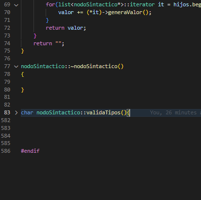

# Compilador-c
 Compilador de c hecho en c++ :)

<!-- Improved compatibility of back to top link: See: https://github.com/othneildrew/Best-README-Template/pull/73 -->
<a name="readme-top"></a>
<!--
*** Thanks for checking out the Best-README-Template. If you have a suggestion
*** that would make this better, please fork the repo and create a pull request
*** or simply open an issue with the tag "enhancement".
*** Don't forget to give the project a star!
*** Thanks again! Now go create something AMAZING! :D
-->


<!-- PROJECT SHIELDS -->
<!--
*** I'm using markdown "reference style" links for readability.
*** Reference links are enclosed in brackets [ ] instead of parentheses ( ).
*** See the bottom of this document for the declaration of the reference variables
*** for contributors-url, forks-url, etc. This is an optional, concise syntax you may use.
*** https://www.markdownguide.org/basic-syntax/#reference-style-links
-->


<!-- PROJECT LOGO -->
<br />
<div align="center">
  <a href="https://github.com/Crissomar1/Compilador-c">
    
  </a>

  <h3 align="center">Compilador C de Crisso</h3>

  <p align="center">
    Proyecto hecho para el Seminario de Solucion de Problemas de Traductores de Lenguaje
    <br />
    <a href="https://github.com/Crissomar1/Compilador-c"><strong>Explore los archivos »</strong></a>
    <br />
    <br />
    <a href="https://github.com/Crissomar1/Compilador-c">Mire la demostracion</a>
    ·
    <a href="https://github.com/Crissomar1/Compilador-c/issues">Reporte un error</a>
    ·
    <a href="https://github.com/Crissomar1/Compilador-c/issues">Solicite una funcion</a>
  </p>
</div>


<!-- TABLE OF CONTENTS -->
<details>
  <summary>Tabla de contenidos</summary>
  <ol>
    <li>
      <a href="#Acerca-del-proyecto">Acerca del proyecto</a>
      <ul>
        <li><a href="#Resultados:">Resultados</a></li>
        <li><a href="#Hecho-con">Hecho con</a></li>
      </ul>
    </li>
    <li>
      <a href="#Iniciacion">Iniciacion</a>
      <ul>
        <li><a href="#Prerrequisitos">Prerrequisitos</a></li>
        <li><a href="#Instalacion">Instalacion</a></li>
      </ul>
    </li>
    <li><a href="#Uso">Uso</a></li>
    <li><a href="#roadmap">Roadmap</a></li>
    <li><a href="#Contacto">Contacto</a></li>
    <li><a href="#Agradecimientos">Agradecimientos</a></li>
  </ol>
</details>


<!-- ABOUT THE PROJECT -->
## Acerca del proyecto


_Reglas del analizador semántico:

Para el analizador semántico me inspire con las que proporciono el profesor, programe cada regla para validar sus simbolos, variables y funciones, implemente una tabla de simbolos para administrar variables, funciones y sus parametros.
Solo aplique Programacion orientada a objetos el "nodoSintactico" cuenta con una lista de nodos hijos, el mismo nodo sirve para los estados y los no terminales.
Cada regla tiene su propio codigo para validar sus simbolos, variables y funciones ademas.

Funciones:
* Analiza por elemento lexico.
* Almaecena los elementos lexicos en una pila.
* Programacion orientada a objetos.
* Procesa la informacion de la tabla.
* Desplazamientos en tabla.
* Reducciones dependiendo de reglas.
* Analizador semantico.
* Tabla de simbolos.
* Manejo de errores:
* Manejo de errores semanticos.
* Manejo de errores sintacticos.
* Manejo de errores lexicos.

Falta:
* Generar codigo intermedio.

### Tabla de simbolos
```cpp
class ElementoTabla
{
public:
    string ambito;
    string simbolo;
    string tipo;
    char tipoDato;
    void muestra();
};

void ElementoTabla::muestra()
{
    cout << "Simbolo: " << tipo << tipoDato << simbolo << " en: " << ambito << endl;
}

class TablaSimbolos
{
public:
    list<ElementoTabla> tabla;
    void inserta(string simbolo, string tipo, char tipoDato, string ambito);
    void muestra();
    bool existe(string simbolo, string ambito);
    string getTipo(string simbolo, string ambito);
    char getTipoDato(string simbolo, string ambito);
    char getTipoAnt();
    char getTipoDatoArg(int espacio, string ambito);
};

void TablaSimbolos::inserta(string simbolo, string tipo, char tipoDato, string ambito)
{
    ElementoTabla elemento;
    elemento.simbolo = simbolo;
    elemento.tipo = tipo;
    elemento.tipoDato = tipoDato;
    elemento.ambito = ambito;
    tabla.push_back(elemento);
}

void TablaSimbolos::muestra()
{
    list<ElementoTabla>::iterator it;
    for (it = tabla.begin(); it != tabla.end(); it++)
    {
        (*it).muestra();
    }
}

bool TablaSimbolos::existe(string simbolo, string ambito)
{
    list<ElementoTabla>::iterator it;
    for (it = tabla.begin(); it != tabla.end(); it++)
    {
        if ((*it).simbolo == simbolo && (*it).ambito == ambito)
        {
            return true;
        }
    }
    return false;
}

string TablaSimbolos::getTipo(string simbolo, string ambito)
{
    list<ElementoTabla>::iterator it;
    for (it = tabla.begin(); it != tabla.end(); it++)
    {
        if ((*it).simbolo == simbolo && (*it).ambito == ambito)
        {
            return (*it).tipo;
        }
    }
    for (it = tabla.begin(); it != tabla.end(); it++)
    {
        if ((*it).simbolo == simbolo && (*it).ambito == "global")
        {
            return (*it).tipo;
        }
    }
    return "";
}

char TablaSimbolos::getTipoDato(string simbolo, string ambito)
{
    list<ElementoTabla>::iterator it;
    for (it = tabla.begin(); it != tabla.end(); it++)
    {
        if ((*it).simbolo == simbolo && (*it).ambito == ambito)
        {
            return (*it).tipoDato;
        }
    }
    for(it = tabla.begin(); it != tabla.end(); it++)
    {
        if((*it).simbolo == simbolo && (*it).ambito == ambito+"Param")
        {
            return (*it).tipoDato;
        }
    }
    for(it = tabla.begin(); it != tabla.end(); it++)
    {
        if((*it).simbolo == simbolo && (*it).ambito == "global")
        {
            return (*it).tipoDato;
        }
    }
    
    return ' ';
}

char TablaSimbolos::getTipoAnt()
{
    return tabla.end()->tipoDato;
}

char TablaSimbolos::getTipoDatoArg(int espacio, string ambito)
{
    ambito = ambito + "Param";
    int contador = 0;
    list<ElementoTabla>::iterator it;
    for (it = tabla.begin(); it != tabla.end(); it++)
    {
        if((*it).ambito == ambito)
        {
            if(contador == espacio)
            {
                return (*it).tipoDato;
            }
            contador++;
        }
    }
    return ' ';
}
```

### Analizador semántico


_Codigo del analizador semántico_


### Resultados:


<p align="right">(<a href="#readme-top">back to top</a>)</p>


### Hecho con


* [![Cpp][C++]][C++-url]
* [![VSCode][VSC]][VSCode-url]

<p align="right">(<a href="#readme-top">back to top</a>)</p>


<!-- GETTING STARTED -->
## Iniciacion

Para hacer uso de este magnifico compilador debes contar con lo siguiente:

### Prerrequisitos

GCC por MinGW Instalacion mediante [MSYS2](https://www.msys2.org/)
* MSYS2
  ```sh
  pacman -S --needed base-devel mingw-w64-x86_64-toolchain
  ```

### Instalacion

_Instalacion del codigo._

1. Descarga el repositorio o clonalo.
2. Descomprime si es necesario.
2. Encuentrate en la ubicacion del codigo fuente.
3. Inicia una instancia de PowerShell en la misma ubicacion
3. Corre el programa
   ```sh
   g++ principal.cpp
   ```

<p align="right">(<a href="#readme-top">back to top</a>)</p>


<!-- USAGE EXAMPLES -->
## Uso

Introduce en Prueba.txt el texto a analizar y traducir

Ejemplo:  _"int main(){}"_


<!--_For more examples, please refer to the [Documentation](https://example.com)_-->

<p align="right">(<a href="#readme-top">back to top</a>)</p>


<!-- ROADMAP -->
## Roadmap

- [x] Analizador Léxico
- [x] Analizador Sintáctico 
    - [x] Analizador sintáctico con objetos  
- [x] Gramatica
- [ ] Analizador Semántico
- [ ] Generador de Código Intermedio
- [ ] Generador de Código Objetivo


<p align="right">(<a href="#readme-top">back to top</a>)</p>


<!-- CONTACT -->
## Contacto

Cristian Morales - crissomar@hotmail.com

Project Link: [https://github.com/Crissomar1/Compilador-c](https://github.com/Crissomar1/Compilador-c)

<p align="right">(<a href="#readme-top">back to top</a>)</p>


<!-- ACKNOWLEDGMENTS -->
## Agradecimientos

De este repositorio me inspire :)

* [GitHub Profesor](https://github.com/TraductoresLenguajes2/Traductores)

<p align="right">(<a href="#readme-top">Regresa al inicio</a>)</p>


<!-- MARKDOWN LINKS & IMAGES -->
<!-- https://www.markdownguide.org/basic-syntax/#reference-style-links -->

[C++]: https://img.shields.io/badge/c++-%2300599C.svg?style=for-the-badge&logo=c%2B%2B&logoColor=white
[C++-url]: https://www.mingw-w64.org/
[VSC]: https://img.shields.io/badge/Visual%20Studio%20Code-0078d7.svg?style=for-the-badge&logo=visual-studio-code&logoColor=white
[VSCode-url]: https://code.visualstudio.com/