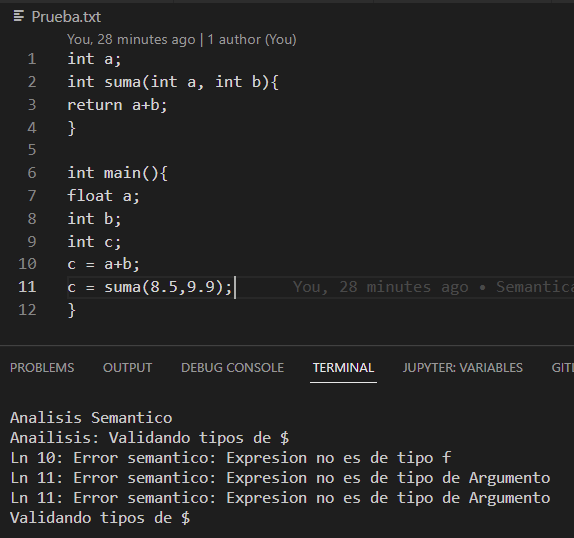

# Compilador-c
 Compilador de c hecho en c++ :)

<!-- Improved compatibility of back to top link: See: https://github.com/othneildrew/Best-README-Template/pull/73 -->
<a name="readme-top"></a>
<!--
*** Thanks for checking out the Best-README-Template. If you have a suggestion
*** that would make this better, please fork the repo and create a pull request
*** or simply open an issue with the tag "enhancement".
*** Don't forget to give the project a star!
*** Thanks again! Now go create something AMAZING! :D
-->


<!-- PROJECT SHIELDS -->
<!--
*** I'm using markdown "reference style" links for readability.
*** Reference links are enclosed in brackets [ ] instead of parentheses ( ).
*** See the bottom of this document for the declaration of the reference variables
*** for contributors-url, forks-url, etc. This is an optional, concise syntax you may use.
*** https://www.markdownguide.org/basic-syntax/#reference-style-links
-->


<!-- PROJECT LOGO -->
<br />
<div align="center">
  <a href="https://github.com/Crissomar1/Compilador-c">
    
  </a>

  <h3 align="center">Compilador C de Crisso</h3>

  <p align="center">
    Proyecto hecho para el Seminario de Solucion de Problemas de Traductores de Lenguaje
    <br />
    <a href="https://github.com/Crissomar1/Compilador-c"><strong>Explore los archivos »</strong></a>
    <br />
    <br />
    <a href="https://github.com/Crissomar1/Compilador-c">Mire la demostracion</a>
    ·
    <a href="https://github.com/Crissomar1/Compilador-c/issues">Reporte un error</a>
    ·
    <a href="https://github.com/Crissomar1/Compilador-c/issues">Solicite una funcion</a>
  </p>
</div>


<!-- TABLE OF CONTENTS -->
<details>
  <summary>Tabla de contenidos</summary>
  <ol>
    <li>
      <a href="#Acerca-del-proyecto">Acerca del proyecto</a>
      <ul>
        <li><a href="#Hecho-con">Hecho con</a></li>
      </ul>
    </li>
    <li>
      <a href="#Iniciacion">Iniciacion</a>
      <ul>
        <li><a href="#Prerrequisitos">Prerrequisitos</a></li>
        <li><a href="#Instalacion">Instalacion</a></li>
      </ul>
    </li>
    <li><a href="#Uso">Uso</a></li>
    <li><a href="#roadmap">Roadmap</a></li>
    <li><a href="#Contacto">Contacto</a></li>
    <li><a href="#Agradecimientos">Agradecimientos</a></li>
  </ol>
</details>


<!-- ABOUT THE PROJECT -->
## Acerca del proyecto


_Tabla del analizador sintáctico_

Para el analizador sintáctico me inspire del codigo que proporciono el profesor, agregue ya todos los codigos al lexico y programe los ejercicios, traduje los codigos del lexico al los codigos de la tabla del ejercicio, procese la informacion de la tabla correctamente.
Solo aplique Programacion orientada a objetos el "nodoSintactico" cuenta con una lista de nodos hijos, el mismo nodo sirve para los estados y los no terminales.
Ya cree una clase para cargar la gramatica con los vectores correspondientes desde el archivo compilador.lr

Funciones:
* Analiza por elemento lexico.
* Almaecena los elementos lexicos en una pila.
* Programacion orientada a objetos.
* Procesa la informacion de la tabla.
* Desplazamientos en tabla.
* Reducciones dependiendo de reglas.

Falta:
* analizador semantico

###nodosSintactico
```cpp
class Gramatica
{
    public:
    int reglas;
    vector<int> idRegla;
    vector<int> lonRegla;
    vector<string> simRegla;
    int filas, columnas;
    vector<vector<int> > tablaLR;
    Gramatica();
    ~Gramatica();
};

Gramatica::Gramatica()
{
    //leer archivo
    ifstream archivo("GramaticaCompilador/compilador.lr", ios::in);
    if(archivo.fail()){
        cout << "No se pudo abrir el archivo" << endl;
        exit(1);
    }
    //leer reglas
    archivo >> reglas;
    idRegla.resize(reglas);
    lonRegla.resize(reglas);
    simRegla.resize(reglas);
    for(int i = 0; i < reglas; i++){
        archivo >> idRegla[i];
        archivo >> lonRegla[i];
        archivo >> simRegla[i];
    }
    //leer tabla
    archivo >> filas >> columnas;
    tablaLR.resize(filas);
    for(int i = 0; i < filas; i++){
        tablaLR[i].resize(columnas);
        for(int j = 0; j < columnas; j++){
            archivo >> tablaLR[i][j];
        }
    }
    archivo.close();
    
}

Gramatica::~Gramatica()
{
}
```

###Analizador sintactico

```cpp
void desplazar(){
    nodoSintactico *estado= new nodoSintactico('E',columna,siguienteFila,lexico.simbolo);
    pila.push(estado);
}

void reducir(){
    int regla = abs(siguienteFila)-2;
    int n = gramatica.lonRegla[regla];
    nodoSintactico *nodo= new nodoSintactico('N',siguienteFila,gramatica.idRegla[regla],gramatica.simRegla[regla]);
    for(int i=0;i<n;i++){
        nodo->hijos.push_front(pila.top());
        pila.pop();
    }

    columna=gramatica.idRegla[regla];
    fila = pila.top()->fila;

    pila.push(nodo);

    siguienteFila = gramatica.tablaLR[fila][columna];
    pila.top()->fila = siguienteFila;

    cout <<endl<< "Regla: " << gramatica.simRegla[regla] << endl;
    cout << "fila: " << fila << endl;
    cout << "columna: " << columna << endl;
    cout << "accion: " << siguienteFila << endl<<endl;

    siguienteFila = gramatica.tablaLR[pila.top()->fila][lexico.tipo];
    
    cout << "accion: " << siguienteFila << endl<<endl;
    if(siguienteFila<-1){
        reducir();
        return;
    }

    nodoSintactico *nodo2= new nodoSintactico('E',lexico.tipo,siguienteFila,lexico.simbolo);
    pila.push(nodo2);
}

void semantica(){
    while (true)
    {
        lexico.sigSimbolo();

        fila=pila.top()->fila;
        columna=lexico.tipo;
        
        siguienteFila=gramatica.tablaLR[fila][columna];

        pila.muestra();
        cout << "entrada: " << lexico.simbolo << endl;
        cout << "fila: " << fila << endl;
        cout << "accion: " << siguienteFila << endl;
        if (siguienteFila>0){
            desplazar();
        }
        if (siguienteFila<=-2){
            reducir();
            pila.muestra();
            cout << "entrada: " << lexico.simbolo << endl;
            cout << "fila: " << fila << endl;
            cout << "accion: " << siguienteFila << endl;
        }
        if (siguienteFila==-1){
            cout << "aceptación" << endl;
            break;
        }
        if (siguienteFila==0){
          cout << "error simbolo inesperado: " << lexico.simbolo << endl;
            cin.get();
            return;
        }
        cin.get();

    }
    

    std::cin.get();
}
```

Resultado:





<p align="right">(<a href="#readme-top">back to top</a>)</p>


### Hecho con


* [![Cpp][C++]][C++-url]
* [![VSCode][VSC]][VSCode-url]

<p align="right">(<a href="#readme-top">back to top</a>)</p>


<!-- GETTING STARTED -->
## Iniciacion

Para hacer uso de este magnifico compilador debes contar con lo siguiente:

### Prerrequisitos

GCC por MinGW Instalacion mediante [MSYS2](https://www.msys2.org/)
* MSYS2
  ```sh
  pacman -S --needed base-devel mingw-w64-x86_64-toolchain
  ```

### Instalacion

_Instalacion del codigo._

1. Descarga el repositorio o clonalo.
2. Descomprime si es necesario.
2. Encuentrate en la ubicacion del codigo fuente.
3. Inicia una instancia de PowerShell en la misma ubicacion
3. Corre el programa
   ```sh
   g++ principal.cpp
   ```

<p align="right">(<a href="#readme-top">back to top</a>)</p>


<!-- USAGE EXAMPLES -->
## Uso

Introduce en Prueba.txt el texto a analizar y traducir

Ejemplo:  _"int main(){}"_


<!--_For more examples, please refer to the [Documentation](https://example.com)_-->

<p align="right">(<a href="#readme-top">back to top</a>)</p>


<!-- ROADMAP -->
## Roadmap

- [x] Analizador Léxico
- [x] Analizador Sintáctico 
    - [x] Analizador sintáctico con objetos  
- [x] Gramatica
- [ ] Analizador Semántico
- [ ] Generador de Código Intermedio
- [ ] Generador de Código Objetivo


<p align="right">(<a href="#readme-top">back to top</a>)</p>


<!-- CONTACT -->
## Contacto

Cristian Morales - crissomar@hotmail.com

Project Link: [https://github.com/Crissomar1/Compilador-c](https://github.com/Crissomar1/Compilador-c)

<p align="right">(<a href="#readme-top">back to top</a>)</p>


<!-- ACKNOWLEDGMENTS -->
## Agradecimientos

De este repositorio me inspire :)

* [GitHub Profesor](https://github.com/TraductoresLenguajes2/Traductores)

<p align="right">(<a href="#readme-top">Regresa al inicio</a>)</p>


<!-- MARKDOWN LINKS & IMAGES -->
<!-- https://www.markdownguide.org/basic-syntax/#reference-style-links -->

[C++]: https://img.shields.io/badge/c++-%2300599C.svg?style=for-the-badge&logo=c%2B%2B&logoColor=white
[C++-url]: https://www.mingw-w64.org/
[VSC]: https://img.shields.io/badge/Visual%20Studio%20Code-0078d7.svg?style=for-the-badge&logo=visual-studio-code&logoColor=white
[VSCode-url]: https://code.visualstudio.com/