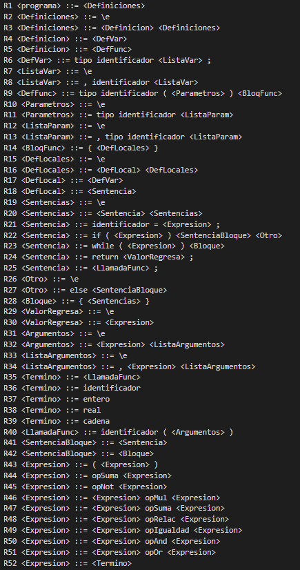

# Compilador-c
 Compilador de c hecho en c++ :)

<!-- Improved compatibility of back to top link: See: https://github.com/othneildrew/Best-README-Template/pull/73 -->
<a name="readme-top"></a>
<!--
*** Thanks for checking out the Best-README-Template. If you have a suggestion
*** that would make this better, please fork the repo and create a pull request
*** or simply open an issue with the tag "enhancement".
*** Don't forget to give the project a star!
*** Thanks again! Now go create something AMAZING! :D
-->


<!-- PROJECT SHIELDS -->
<!--
*** I'm using markdown "reference style" links for readability.
*** Reference links are enclosed in brackets [ ] instead of parentheses ( ).
*** See the bottom of this document for the declaration of the reference variables
*** for contributors-url, forks-url, etc. This is an optional, concise syntax you may use.
*** https://www.markdownguide.org/basic-syntax/#reference-style-links
-->


<!-- PROJECT LOGO -->
<br />
<div align="center">
  <a href="https://github.com/Crissomar1/Compilador-c">
    
  </a>

  <h3 align="center">Compilador C de Crisso</h3>

  <p align="center">
    Proyecto hecho para el Seminario de Solucion de Problemas de Traductores de Lenguaje
    <br />
    <a href="https://github.com/Crissomar1/Compilador-c"><strong>Explore los archivos »</strong></a>
    <br />
    <br />
    <a href="https://github.com/Crissomar1/Compilador-c">Mire la demostracion</a>
    ·
    <a href="https://github.com/Crissomar1/Compilador-c/issues">Reporte un error</a>
    ·
    <a href="https://github.com/Crissomar1/Compilador-c/issues">Solicite una funcion</a>
  </p>
</div>


<!-- TABLE OF CONTENTS -->
<details>
  <summary>Tabla de contenidos</summary>
  <ol>
    <li>
      <a href="#Acerca-del-proyecto">Acerca del proyecto</a>
      <ul>
        <li><a href="#Hecho-con">Hecho con</a></li>
      </ul>
    </li>
    <li>
      <a href="#Iniciacion">Iniciacion</a>
      <ul>
        <li><a href="#Prerrequisitos">Prerrequisitos</a></li>
        <li><a href="#Instalacion">Instalacion</a></li>
      </ul>
    </li>
    <li><a href="#Uso">Uso</a></li>
    <li><a href="#roadmap">Roadmap</a></li>
    <li><a href="#Contacto">Contacto</a></li>
    <li><a href="#Agradecimientos">Agradecimientos</a></li>
  </ol>
</details>


<!-- ABOUT THE PROJECT -->
## Acerca del proyecto



_Tabla del analizador sintáctico_

Para el analizador sintáctico me inspire del codigo que proporciono el profesor, agregue ya todos los codigos al lexico y programe los ejercicios, traduje los codigos del lexico al los codigos de la tabla del ejercicio, procese la informacion de la tabla correctamente.

Funciones:
* Analiza por elemento lexico.
* Desplazamientos en tabla.
* Reducciones dependiendo de reglas.

###Analizador

```cpp
int tablaLR[5][4]={
        2, 0, 0, 1,
        0, 0, -1, 0,
        0, 3, -3, 0,
        2, 0, 0, 4,
        0, 0, -2, 0
    };
    int idReglas[2]={2,2};
    int lonReglas[2]={3,1};


    Pila<int> pila;
    int fila, columna, accion;
    bool aceptacion;

    pila.push(/*TipoSimbolo::PESOS*/2);//2 en el ejemplo y ejercicios actual
    pila.push(0);

    Lexico lexico; 
    lexico.entrada("a+b+c+d+e+f");
    while (true)
    {
        lexico.sigSimbolo();

        fila=pila.top();
        switch(lexico.tipo){    //Un pequeño traductor de analizador lexico para que funcione con nuestra tabla de transiciones
            case TipoSimbolo::IDENTIFICADOR:
                columna=0;
                break;
            case TipoSimbolo::OPADIC:
                columna=1;
                break;
            case TipoSimbolo::PESOS:
                columna=2;
                break;
        }
        accion=tablaLR[fila][columna];

        pila.muestra();
        cout << "entrada: " << lexico.simbolo << endl;
        cout << "accion: " << accion << endl;
        if (accion>0){
            pila.push(lexico.tipo);
            pila.push(accion);
        }
        if (accion<=-2){
            int rule=abs(accion)-2;//se resta 1 por el offset a la representacion de reglas en negativo y se resta otro por dispocision de arreglos de reglas
            int red=lonReglas[rule]*2;
            int ter=idReglas[rule];
            int i=0;
            
            while(i<red){
                pila.pop();
                i++;
            }
            
            fila=pila.top();
            switch(lexico.tipo){    //Un pequeño traductor de analizador lexico para que funcione con nuestra tabla de transiciones
            case TipoSimbolo::IDENTIFICADOR:
                columna=0;
                break;
            case TipoSimbolo::OPADIC:
                columna=1;
                break;
            case TipoSimbolo::PESOS:
                columna=2;
                break;
             }
            accion=tablaLR[fila][3];

            pila.push(ter);
            pila.push(accion);
            pila.muestra();
            cout << "entrada: " << lexico.simbolo << endl;
            cout << "accion: " << accion << endl;
        }
        if (accion==-1) cout << "aceptación" << endl;
```

Resultado:


<p align="right">(<a href="#readme-top">back to top</a>)</p>


### Hecho con


* [![Cpp][C++]][C++-url]
* [![VSCode][VSC]][VSCode-url]

<p align="right">(<a href="#readme-top">back to top</a>)</p>


<!-- GETTING STARTED -->
## Iniciacion

Para hacer uso de este magnifico compilador debes contar con lo siguiente:

### Prerrequisitos

GCC por MinGW Instalacion mediante [MSYS2](https://www.msys2.org/)
* MSYS2
  ```sh
  pacman -S --needed base-devel mingw-w64-x86_64-toolchain
  ```

### Instalacion

_Instalacion del codigo._

1. Descarga el repositorio o clonalo.
2. Descomprime si es necesario.
2. Encuentrate en la ubicacion del codigo fuente.
3. Inicia una instancia de PowerShell en la misma ubicacion
3. Corre el programa
   ```sh
   g++ principal.cpp
   ```

<p align="right">(<a href="#readme-top">back to top</a>)</p>


<!-- USAGE EXAMPLES -->
## Uso

Introduce en principal.cpp el texto a analizar y traducir justo en "lexico.entrada()"

Ejemplo:  _"a+b+c+d+e+f"_


<!--_For more examples, please refer to the [Documentation](https://example.com)_-->

<p align="right">(<a href="#readme-top">back to top</a>)</p>


<!-- ROADMAP -->
## Roadmap

- [x] Analizador Léxico
- [x] Analizador Sintáctico 
- [ ] Gramatica
- [ ] Analizador Semántico
- [ ] Multi-language Support
    - [ ] Chinese
    - [ ] Spanish


<p align="right">(<a href="#readme-top">back to top</a>)</p>


<!-- CONTACT -->
## Contacto

Cristian Morales - crissomar@hotmail.com

Project Link: [https://github.com/Crissomar1/Compilador-c](https://github.com/Crissomar1/Compilador-c)

<p align="right">(<a href="#readme-top">back to top</a>)</p>


<!-- ACKNOWLEDGMENTS -->
## Agradecimientos

De este repositorio me inspire :)

* [GitHub Profesor](https://github.com/TraductoresLenguajes2/Traductores)

<p align="right">(<a href="#readme-top">Regresa al inicio</a>)</p>


<!-- MARKDOWN LINKS & IMAGES -->
<!-- https://www.markdownguide.org/basic-syntax/#reference-style-links -->

[C++]: https://img.shields.io/badge/c++-%2300599C.svg?style=for-the-badge&logo=c%2B%2B&logoColor=white
[C++-url]: https://www.mingw-w64.org/
[VSC]: https://img.shields.io/badge/Visual%20Studio%20Code-0078d7.svg?style=for-the-badge&logo=visual-studio-code&logoColor=white
[VSCode-url]: https://code.visualstudio.com/